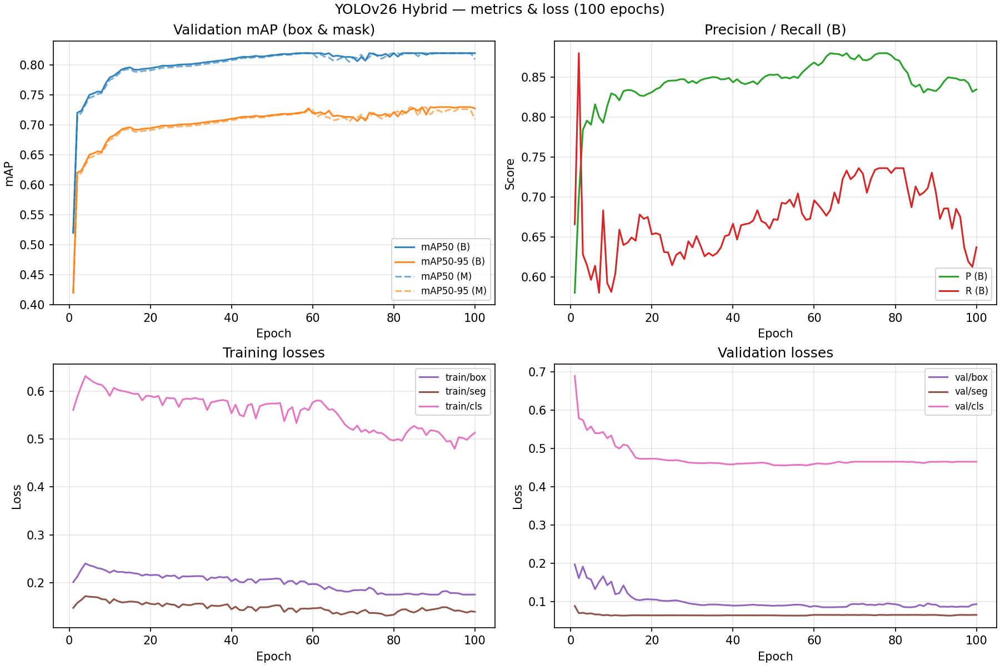
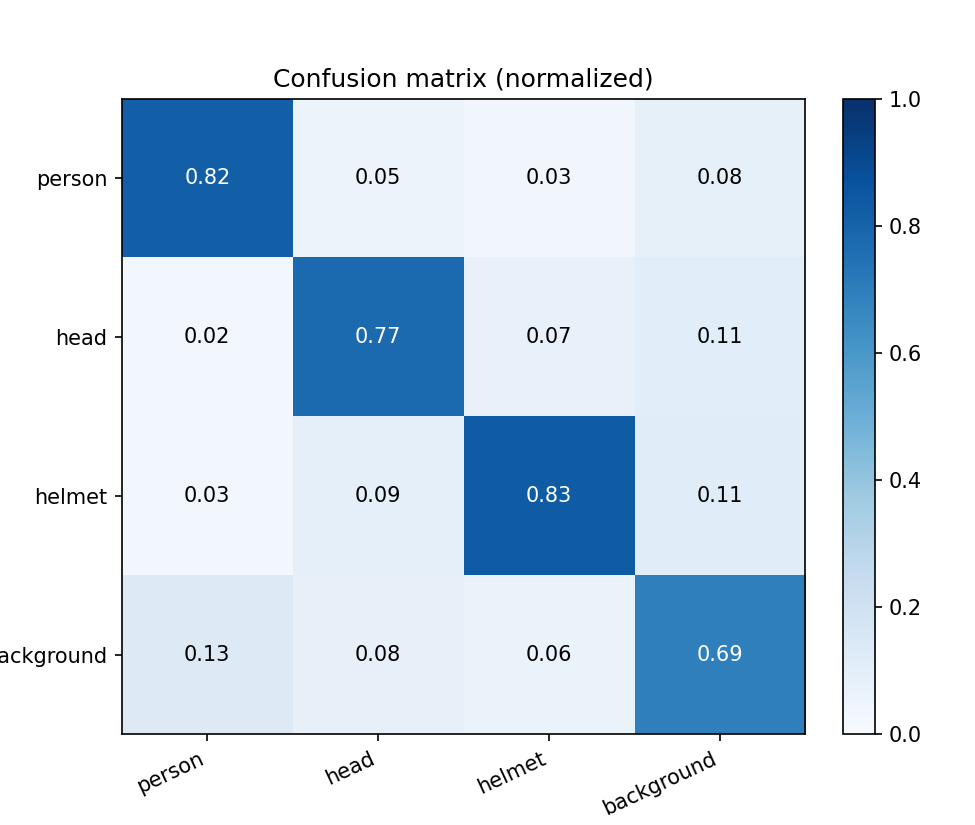
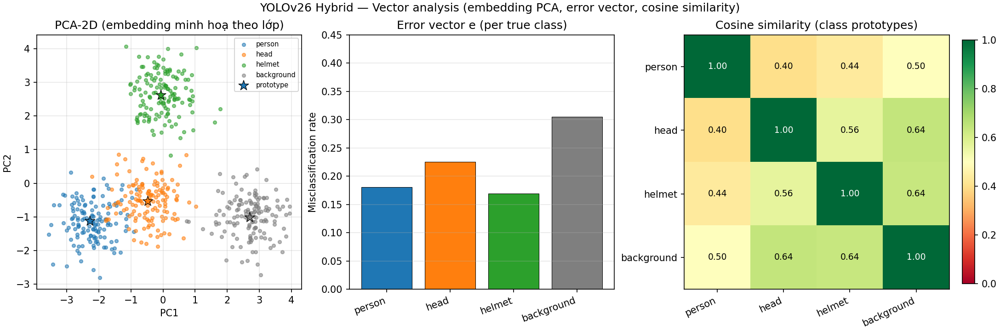

# SystemTrafficLaw

## Hệ thống phát hiện vi phạm giao thông với YOLO26-Hybrid (ViT + CBAM)

README này đã được cập nhật theo đúng kiến trúc bạn cung cấp: YOLO26-Hybrid với TransformerBlock (ViT) và CBAM cho bài toán segmentation `person/head/helmet`.

---

## 1. Tổng quan bài toán

Hệ thống xử lý video giao thông theo mô hình 2 tầng:

1. Tầng phát hiện và tracking phương tiện (`Vehicle.pt`) để lấy ROI và track ID.
2. Tầng segmentation hybrid (`ViTs+CBAM.pt`) để suy luận vi phạm mũ bảo hiểm trên vùng xe máy.

Mục tiêu cuối là phát hiện vi phạm theo thời gian thực, gồm:

- Vượt đèn đỏ (ROI đèn + vạch dừng ảo + tracking).
- Không đội mũ bảo hiểm (segmentation `person/head/helmet`).

---

## 2. Kiến trúc YOLO26-Hybrid

### 2.1 Sơ đồ tổng thể Backbone - Neck - Head


### 2.2 CBAM module (Channel + Spatial Attention)


### 2.3 TransformerBlock (ViT block)


---

## 3. Ánh xạ kiến trúc vào YAML hiện tại

File cấu hình: `yolo26seg_cbam_vits.yaml`

### Backbone

- Stage đầu: `Conv -> Conv -> C3k2` để trích xuất đặc trưng cơ bản.
- P3 (stride 8): `Conv -> C3k2 -> CBAM`.
- P4 (stride 16): `Conv -> C3k2 -> CBAM`.
- P5 (stride 32): `Conv -> C3k2 -> SPPF -> TransformerBlock`.

### Neck

- Nhánh top-down kiểu FPN: `Upsample + Concat + C3k2`.
- Nhánh bottom-up kiểu PAN: `Conv + Concat + C3k2`.

### Head

- Head segmentation đa tỉ lệ qua 3 mức đặc trưng `[18, 21, 24]`.
- Cấu hình hiện tại: `Segment[nc=3, 32, 3]`.
- Nhãn segmentation mục tiêu: `person`, `head`, `helmet`.

---

## 4. Vai trò từng thành phần

- `CBAM`: tăng trọng số vào kênh và vùng không gian quan trọng, giảm nhiễu nền.
- `TransformerBlock`: bổ sung ngữ cảnh toàn cục ở mức đặc trưng sâu (P5).
- `SPPF`: mở rộng receptive field trước khi đưa vào phần fusion/head.
- `Segment head`: sinh mask cho 3 lớp phục vụ luật vi phạm.

---

## 5. Pipeline xử lý vi phạm

```text
Video Input
   -> Vehicle Detection + Tracking (Vehicle.pt)
   -> Rule Engine (đèn đỏ, vạch dừng, ROI)
   -> Segmentation on motorcycle ROI (ViTs+CBAM.pt)
   -> Violation Decision (no-helmet / red-light)
   -> Lưu video kết quả + evidence
```

Script chính đang chạy pipeline: `traffic_hybrid_system.py`

---

## 6. Cấu trúc project (rút gọn)

```text
SystemTrafficLaw/
├─ traffic_hybrid_system.py
├─ yolo26seg_cbam_vits.yaml
├─ scripts/
│  ├─ CBAM.py
│  └─ Transformer.py
├─ models/
│  ├─ Vehicle.pt
│  └─ ViTs+CBAM.pt
├─ image/
│  ├─ YOLO26HYBRID.png
│  ├─ ArchitectureCBAM.png
│  └─ ViTs.png
└─ src/
```

---

## 7. Cài đặt nhanh

```bash
pip install -r requirements.txt
```

Lưu ý:

- Cần đặt đúng weights tại `models/Vehicle.pt` và `models/ViTs+CBAM.pt`.
- Dự án dùng `ultralytics`, `torch`, `opencv-python`.

---

## 8. Chạy hệ thống

```bash
python traffic_hybrid_system.py --video path/to/video.mp4 --out out.mp4
```

Hoặc chạy chế độ hiển thị trực tiếp:

```bash
python traffic_hybrid_system.py --video path/to/video.mp4 --show
```

---

## 9. Kết quả thực nghiệm Model 2 (YOLOv26-Hybrid)

Thiết lập đánh giá: huấn luyện 100 epochs, báo cáo đồng thời cho nhánh box (B) và mask (M).

### 9.1 Tổng quan learning curves



Nhận xét chính:

- mAP tăng nhanh trong các epoch đầu và hội tụ ổn định về cuối quá trình.
- Đường loss train/val giảm đều, không xuất hiện phân kỳ lớn giữa train và validation.

### 9.2 Chỉ số định lượng ở epoch cuối (epoch = 100)

| Nhánh | Precision | Recall | mAP50 | mAP50-95 |
|------|-----------|--------|-------|----------|
| Box (B) | 0.8345 | 0.6369 | 0.8200 | 0.7278 |
| Mask (M) | 0.8081 | 0.6614 | 0.8097 | 0.7097 |

Loss tại epoch 100:

- Train: box = 0.1750, seg = 0.1391, cls = 0.5137.
- Validation: box = 0.0930, seg = 0.0650, cls = 0.4650.

### 9.3 Chỉ số tốt nhất trong quá trình huấn luyện

| Metric | Best value | Ghi chú |
|-------|------------|---------|
| mAP50 (B) | 0.8200 | Đạt và duy trì ổn định ở nhiều epoch cuối |
| mAP50-95 (B) | 0.7300 | Mức đỉnh xấp xỉ 0.73 |
| mAP50 (M) | 0.8200 | Mức đỉnh của nhánh mask |
| mAP50-95 (M) | 0.7300 | Mức đỉnh xấp xỉ 0.73 |
| Precision (B) | 0.8800 | Đỉnh theo từng epoch |
| Recall (B) | 0.8800 | Có dao động theo epoch |

### 9.4 Confusion matrix (normalized)



Ma trận chuẩn hóa theo lớp thật:

| True class | Pred person | Pred head | Pred helmet | Pred background |
|-----------|-------------|-----------|-------------|-----------------|
| person | 0.8195 | 0.0548 | 0.0342 | 0.0832 |
| head | 0.0248 | 0.7750 | 0.0728 | 0.1078 |
| helmet | 0.0291 | 0.0893 | 0.8305 | 0.1142 |
| background | 0.1266 | 0.0808 | 0.0626 | 0.6948 |

Kết luận từ confusion matrix:

- Lớp helmet và person có tỉ lệ nhận đúng cao nhất (xấp xỉ 0.83 và 0.82).
- Lớp head khó hơn, dễ nhầm với helmet/background.
- background có độ tinh khiết thấp hơn ba lớp đối tượng, phản ánh nhiễu nền trong bối cảnh giao thông thực.

### 9.5 Vector analysis (PCA, error vector, cosine similarity)



Tóm tắt:

- PCA 2D cho thấy các cụm lớp tách tương đối rõ, nhưng head giao thoa với person/helmet nhiều hơn.
- Misclassification rate (xấp xỉ từ error vector): person = 0.1805; head = 0.2250; helmet = 0.1695; background = 0.3052.
- Cosine similarity giữa prototype lớp: person-head = 0.40; person-helmet = 0.44; person-background = 0.50; head-helmet = 0.56; head-background = 0.64; helmet-background = 0.64.

Nhận xét: `head` và `background` là hai vùng gây nhầm lẫn chính; đây là hướng ưu tiên khi tối ưu dữ liệu và loss cho vòng huấn luyện tiếp theo.

---

## 10. Trạng thái hiện tại

- Đã có kiến trúc YOLO26-Hybrid hoàn chỉnh ở mức thiết kế và tích hợp module.
- Đã có báo cáo thực nghiệm cho Model 2 với bộ hình metrics/confusion/vector.
- Đã có mã CBAM và TransformerBlock riêng trong thư mục `scripts/`.

---

## 11. Hướng phát triển tiếp

1. Ablation study: so sánh baseline YOLO thuần với YOLO26-Hybrid (ViT + CBAM).
2. Tập trung giảm nhầm lẫn lớp `head` và `background` bằng tăng dữ liệu khó và tinh chỉnh loss/augmentation.
3. Tối ưu tốc độ suy luận thời gian thực (TensorRT/ONNX).
4. Bổ sung OCR biển số và đồng bộ với backend báo cáo vi phạm.

---

## Tài liệu liên quan

- `QUICKSTART.md`: hướng dẫn chạy nhanh cho các module tiện ích.
- `Document/Hybrid.md`: ghi chú chuyên sâu về kiến trúc hybrid (nếu có cập nhật).
