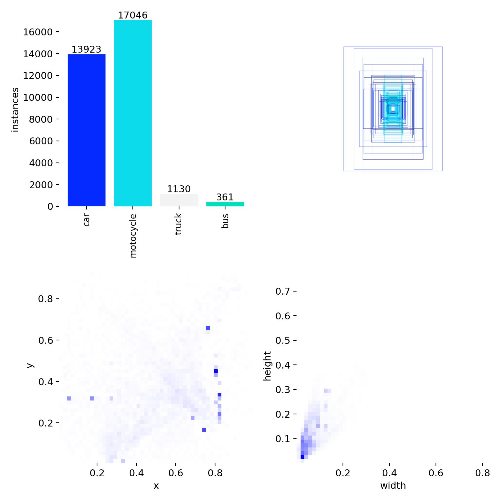
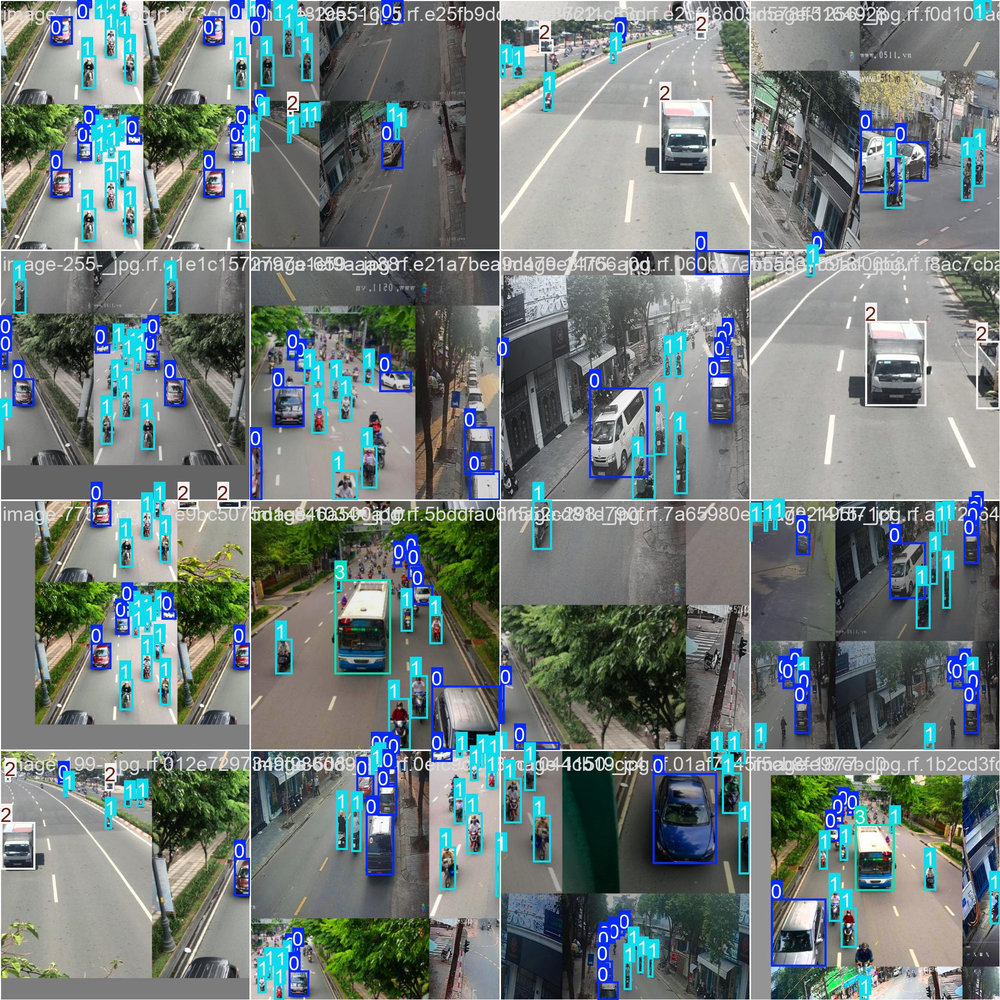
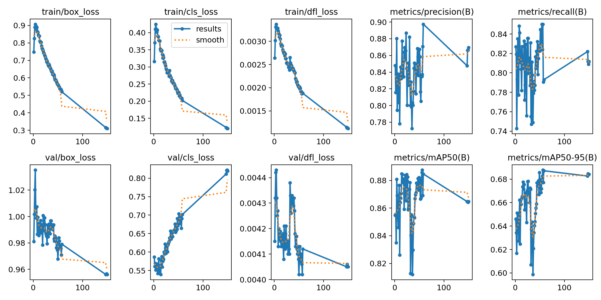
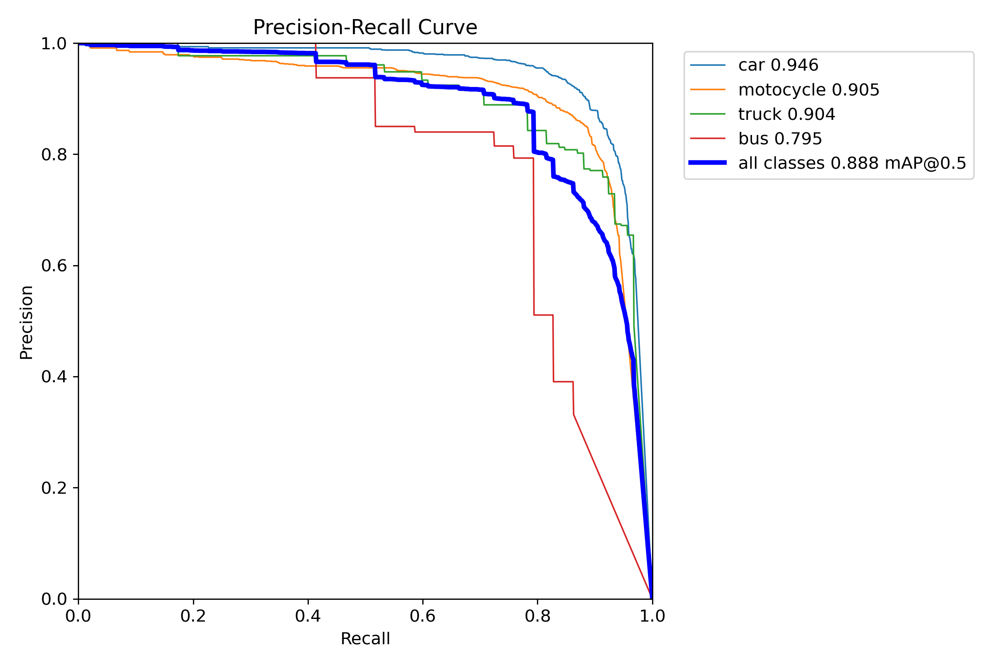
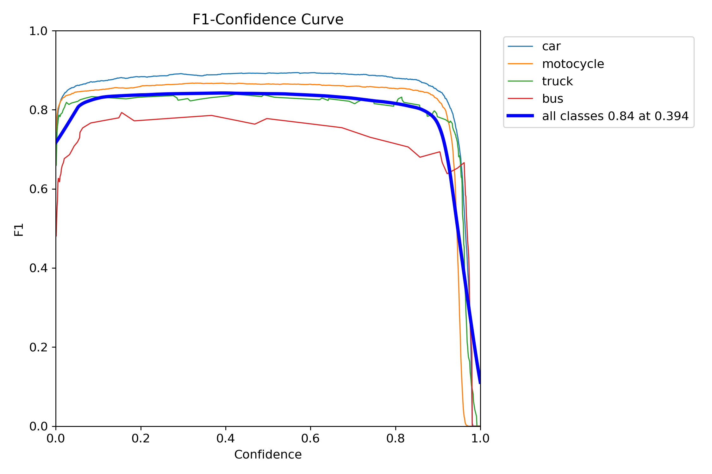
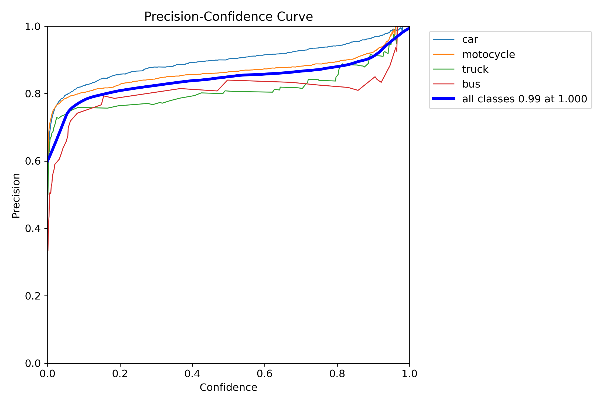
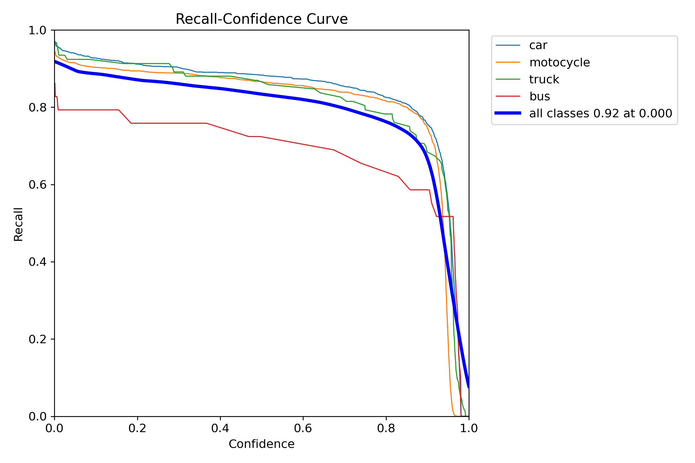
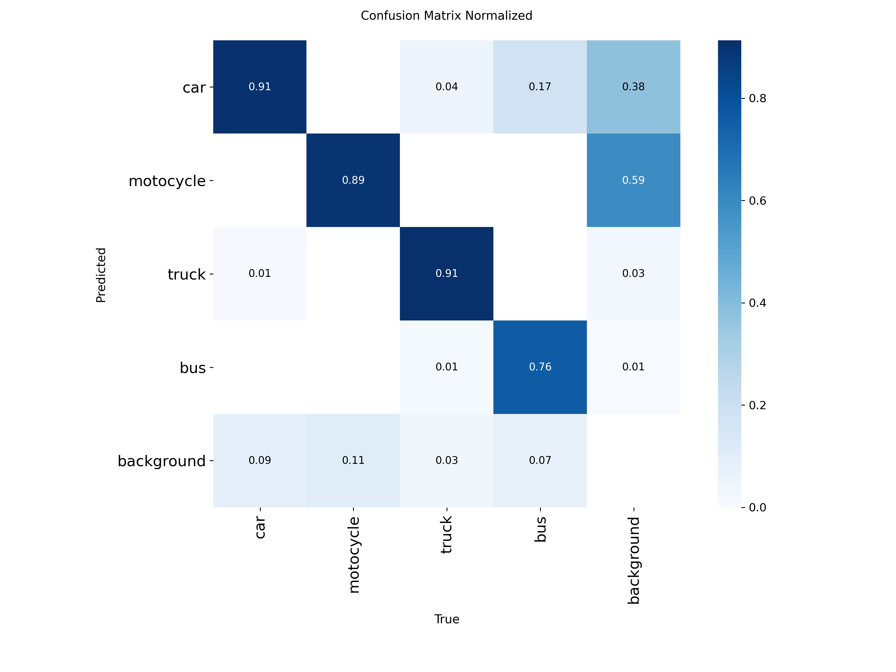
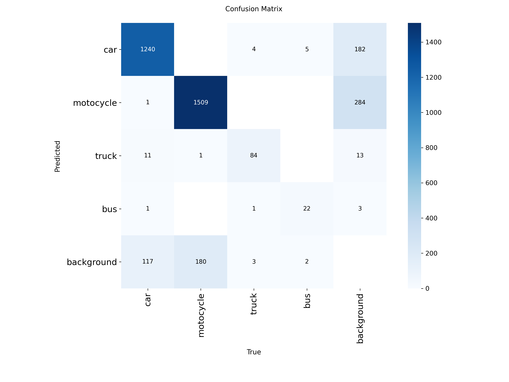

# SystemTrafficLaw
# Traffic Violation Detection System using Deep Learning

## Giới thiệu

Dự án này xây dựng hệ thống phát hiện hành vi vi phạm giao thông dựa trên Computer Vision, Deep Learning và Tracking. 

Hệ thống có khả năng:
- Phát hiện và theo dõi phương tiện giao thông
- Phát hiện hành vi vượt đèn đỏ
- Phát hiện không đội mũ bảo hiểm và chở quá số người (segmentation người / đầu / mũ)
- Tự động chụp ảnh phương tiện vi phạm

**Trọng tâm nghiên cứu và triển khai** là **Model 2 — YOLOv8-Seg hybrid CBAM + ViT**: kết hợp **Transformer ở backbone** (ngữ cảnh toàn cục, vật thể nhỏ/khó) với **CBAM ở neck/head** (tinh chỉnh không gian–kênh, mask sắc nét). Model 1 (phát hiện phương tiện) đóng vai trò **tiền xử lý & định vị ROI**, cung cấp đầu vào cho pipeline segmentation.

Hệ thống được thiết kế theo **pipeline hai mô hình** (vehicle detection → hybrid segmentation), phản ánh quy trình camera giao thông thông minh trong thực tế.

## Mục tiêu dự án

- Ứng dụng YOLO + Tracking + Segmentation hybrid (CNN + attention) vào bài toán giao thông
- Hai mô hình chuyên biệt: phương tiện và người–mũ–đầu
- Xây dựng pipeline từ video → phát hiện vi phạm → bằng chứng hình ảnh
- Phục vụ mục đích nghiên cứu – học tập – demo hệ thống giám sát giao thông
- Làm rõ và tối ưu **kiến trúc hybrid YOLOv8 + CBAM + ViT** cho bài toán **3 lớp**: `person`, `head`, `helmet`

## Trọng tâm dự án: kiến trúc YOLOv8 Hybrid CBAM–ViT Segmentation

Sơ đồ dưới mô tả **YOLOv8-Hybrid CBAM-ViT Segmentation** (3 classes), cấu hình tham chiếu: `yolov8_hybrid_cbam_vit.yaml`. Luồng dữ liệu: ảnh đầu vào (3 kênh, H×W) → **Backbone** trích đặc trưng đa tỉ lệ → **Neck** hợp nhất P3/P4/P5 → **Segment head** xuất **mặt nạ 3 lớp** (người / đầu / mũ).


### Tóm tắt theo khối

| Phần | Nội dung chính |
|------|----------------|
| **Backbone** | Chuỗi `Conv` / `C2f` tạo đặc trưng; **P3 (stride 8)**, **P4 (stride 16)**, **P5 (stride 32)**. **CBAM** gắn sau đặc trưng P3, P4; tại **P5** có **ViT layer** (1024 kênh), tiếp **SPPF**, rồi **CBAM (P5)** — ViT thu ngữ cảnh toàn cục, CBAM làm nổi bật kênh/không gian trước khi đưa lên neck. |
| **Neck (Head fusion)** | `Upsample` + `Concat` nối đặc trưng đa tỉ lệ, các lớp `C2f` (512 → 256) với **chuẩn hoá kênh** giữa backbone và head để tránh lệch kích thước tensor. |
| **Prediction** | Module **Segment** với tham số kiểu `[nc: 3, 32, 3]` — **3 class** segmentation; đầu ra: **bản đồ phân đoạn** (mask) cho từng lớp. |

**Chú thích màu (legend trong sơ đồ):** `Conv` (xanh dương), `C2f` (xanh lá), `SPPF` (cam), `CBAM` (vàng), `Segment` (đỏ đậm).

## Kiến trúc tổng thể hệ thống

```
Camera / Video
      ↓
Model 1: Vehicle Detection + Tracking
      ↓
Phát hiện hành vi vi phạm (logic) + Trigger Capture (khi vi phạm)
      ↓
Model 2 (trọng tâm): YOLOv8-Seg + CBAM + ViT — helmet / head / person
      ↓
Lưu DB & Xuất báo cáo vi phạm
```

## Các mô hình trong hệ thống

### Model 1 – Vehicle Detection & Tracking

**Nhiệm vụ**
- Phát hiện phương tiện và người tham gia giao thông
- Theo dõi đối tượng qua nhiều frame
- Phục vụ phát hiện hành vi vượt đèn đỏ

**Công nghệ**
- YOLOv8 (Detection hoặc Segmentation)
- DeepSORT / ByteTrack

**Class label (checkpoint `vietnam_vehicle_v2`)**
- `car`, `motocycle` (ghi chú: tên lớp trong dataset), `truck`, `bus`

**Output**
- Bounding box / mask
- Track ID
- Quỹ đạo di chuyển

#### Kết quả huấn luyện – `VehicleModel/vietnam_vehicle_v2`

Dữ liệu huấn luyện phản ánh giao thông Việt Nam: lớp **xe máy** và **ô tô** chiếm đa số; **xe tải** và **xe buýt** ít mẫu hơn (mất cân bằng lớp). Phần lớn bbox có kích thước nhỏ trên khung hình (xe ở xa / góc rộng).



**Batch huấn luyện (mosaic augmentation)** — ghép nhiều ảnh giao thông vào một tile, nhãn `0–3` tương ứng `car`, `motocycle`, `truck`, `bus`.



**Tiến trình huấn luyện (~150 epoch)** — loss train giảm; `metrics/mAP50(B)` khoảng **0.86–0.87**, `mAP50-95(B)` khoảng **0.68** cuối đoạn. Lưu ý: nếu **`val/cls_loss` tăng dần** trong khi train/cls giảm, có dấu hiệu **overfitting** phân lớp — có thể tăng augmentation, early stopping hoặc điều chỉnh regularization.



**Đường cong Precision–Recall (mAP@0.5 theo lớp)**

| Lớp | mAP@0.5 |
|-----|---------|
| car | 0.946 |
| motocycle | 0.905 |
| truck | 0.904 |
| bus | 0.795 |
| **Trung bình (all classes)** | **0.888** |



**Đường cong F1 theo ngưỡng confidence**

- Điểm tối ưu gợi ý (trung bình mọi lớp): **F1 ≈ 0.84** tại **confidence ≈ 0.394** (điều chỉnh theo ưu tiên precision hay recall khi triển khai).



**Precision và Recall theo confidence**





**Ma trận nhầm lẫn**

- Lớp **bus** yếu nhất so với các lớn còn lại; có nhầm **bus → car** và tỉ lệ **bus → background**.
- Cần chú ý **false positive**: vùng nền đôi khi bị dự đoán thành `car` / `motocycle` — có thể bổ sung mẫu nền âm (hard negatives) hoặc tinh chỉnh ngưỡng confidence.





### Model 2 – Segmentation người / đầu / mũ (Hybrid YOLOv8-Seg + CBAM + ViTs) — **trọng tâm dự án**

**Nhiệm vụ**
- Phân đoạn (mask) **person**, **head**, **helmet** để suy ra không đội mũ và ước lượng số người trên xe
- Phát hiện hành vi chở quá số người (kết hợp logic với Model 1)

**Kiến trúc chi tiết** nằm ở mục **«Trọng tâm dự án: kiến trúc YOLOv8 Hybrid CBAM–ViT Segmentation»** (sơ đồ + bảng tóm tắt) và file cấu hình `yolov8_hybrid_cbam_vit.yaml`.

**Vai trò từng thành phần (synergy)**

| Thành phần | Vai trò |
|------------|--------|
| **ViT (Backbone, P5)** | Ngữ cảnh toàn cục, hỗ trợ vật thể nhỏ / khó (che khuất, nền rối) |
| **CBAM (sau P3, P4, P5 và trên neck)** | Tinh chỉnh không gian–kênh, giảm nhiễu, cải thiện biên mask |
| **SPPF (P5)** | Nhiều receptive field, bổ sung sau ViT trước CBAM cuối backbone |

**Cộng hưởng:** Transformer ở backbone bù hạn chế receptive field CNN; CBAM ở neck/head tinh chỉnh tọa độ và kênh → mask ổn định, sắc hơn so với chỉ CNN.

**Công nghệ**
- YOLOv8-Seg + module **Segment** (`nc = 3`)
- CBAM theo sơ đồ (P3, P4, P5 + neck)
- ViT layer tích hợp tại nhánh độ phân giải thấp (P5)

**Dữ liệu đầu vào**
- Ảnh / crop từ vùng quan tâm sau Model 1 (ví dụ xe máy + người)

**Class label**
- `person`
- `head`
- `helmet`

**Logic vi phạm (gợi ý)**

*Không đội mũ:* ≥ N frame liên tiếp không có `helmet` trên người cướp xe → vi phạm (N tùy cấu hình).

*Chở quá số người:* một phương tiện (ví dụ xe máy từ Model 1) + số instance `person` vượt ngưỡng quy định → vi phạm.

## Xử lý & tổ chức dữ liệu

### 1. Dữ liệu thô
- Video giao thông từ camera
- Trích xuất frame theo FPS phù hợp

### 2. Tiền xử lý
- Loại bỏ ảnh quá mờ (Laplacian variance)
- Resize ảnh về kích thước chuẩn
- Augmentation: flip, blur, noise

### 3. Annotation

**Lưu ý:** Các model dùng chung dữ liệu ảnh/video, **KHÔNG** dùng chung label

```
raw_images/
labels_model1/
labels_model2/
```

## Chiến lược huấn luyện (Training Strategy)

### Fine-tuning
- Sử dụng pretrained YOLOv8
- Freeze backbone giai đoạn đầu
- Fine-tune head theo từng bài toán
- Batch size & learning rate điều chỉnh theo GPU

### Loss function
- YOLO default loss (box + cls + dfl)
- Mask loss (nếu dùng segmentation)

## Đánh giá mô hình (Evaluation Metrics)

### Detection / Segmentation
- Precision
- Recall
- mAP@0.5
- mAP@0.5:0.95
- IoU

### Tracking
- MOTA
- ID Switch
- FPS

## Cơ chế phát hiện & ghi nhận vi phạm

- Hệ thống chỉ chụp ảnh khi có vi phạm
- Mỗi lỗi là module độc lập
- Một phương tiện có thể vi phạm nhiều lỗi cùng lúc

**Ví dụ:**
```
Không vượt đèn đỏ ❌
Nhưng:
Không đội mũ bảo hiểm ✅
→ Vẫn ghi nhận vi phạm
```

## Kết quả đầu ra

- Ảnh / video kèm mask và bbox vi phạm
- Thời gian & loại vi phạm
- Dữ liệu sẵn sàng hiển thị dashboard hoặc báo cáo

## Hướng phát triển

- Tích hợp nhận dạng biển số (detect biển + OCR) nếu cần mở rộng pipeline
- Nhận diện đi ngược chiều / sai làn
- Tối ưu realtime (TensorRT) cho backbone hybrid
- Kết nối hệ thống IoT / Smart City

## Công nghệ sử dụng

- Python
- YOLOv8 (Detection & Segmentation)
- CBAM, kiến trúc ViT/Swin (backbone hybrid)
- OpenCV
- DeepSORT / ByteTrack
