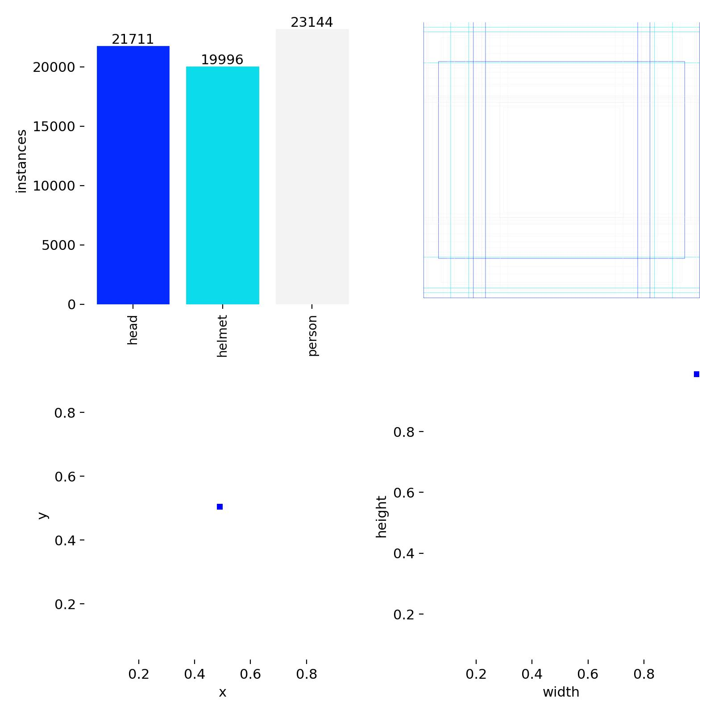

# SystemTrafficLaw

Traffic violation detection system based on a hybrid YOLO segmentation architecture (ViT + CBAM), designed for real-world roadway video analytics.

## Overview

SystemTrafficLaw uses a two-stage inference pipeline:

1. Vehicle detection and tracking (`Vehicle.pt`) to identify vehicles, assign track IDs, and extract regions of interest (ROIs).
2. Hybrid segmentation (`ViTs+CBAM.pt`) on motorcycle ROIs to detect helmet compliance (`person`, `head`, `helmet`).

The current violation logic focuses on:

- Red-light violation detection (traffic-light ROI + virtual stop-line + tracking behavior).
- No-helmet violation detection through segmentation-based reasoning.

## Dataset Collection and Annotation Ownership

All training data used in this project was independently collected, preprocessed, and manually annotated by the project owner.

- Data collection: Captured from real traffic scenarios for the helmet-compliance use case.
- Labeling: Manually labeled for segmentation classes (`person`, `head`, `helmet`).
- Data processing: Processed and validated before training to improve label quality and consistency.

The following two visualizations are from this self-collected and self-annotated dataset:



.jpg)

## Architecture

### Hybrid YOLO26 Design


### CBAM Module


### Transformer (ViT) Block


Model configuration file: `yolo26seg_cbam_vits.yaml`

### Backbone

- Early feature extraction: `Conv -> Conv -> C3k2`
- P3 (stride 8): `Conv -> C3k2 -> CBAM`
- P4 (stride 16): `Conv -> C3k2 -> CBAM`
- P5 (stride 32): `Conv -> C3k2 -> SPPF -> TransformerBlock`

### Neck

- Top-down FPN path: `Upsample + Concat + C3k2`
- Bottom-up PAN path: `Conv + Concat + C3k2`

### Head

- Multi-scale segmentation head over feature levels `[18, 21, 24]`
- Current setting: `Segment[nc=3, 32, 3]`
- Target classes: `person`, `head`, `helmet`

## Component Roles

- `CBAM`: Improves focus on informative channels and spatial regions while suppressing background noise.
- `TransformerBlock`: Injects global context at deep feature levels for robust semantic reasoning.
- `SPPF`: Expands receptive field before feature fusion and final prediction.
- `Segment` head: Produces class-specific masks used by rule-based violation decisions.

## Inference Pipeline

```text
Video Input
   -> Vehicle Detection + Tracking (Vehicle.pt)
   -> Rule Engine (traffic light, stop line, ROI constraints)
   -> Segmentation on motorcycle ROI (ViTs+CBAM.pt)
   -> Violation Decision (no-helmet / red-light)
   -> Output video + evidence artifacts
```

Primary runtime script: `traffic_hybrid_system.py`

## Project Structure (Condensed)

```text
SystemTrafficLaw/
├─ traffic_hybrid_system.py
├─ yolo26seg_cbam_vits.yaml
├─ scripts/
│  ├─ CBAM.py
│  └─ Transformer.py
├─ models/
│  ├─ Vehicle.pt
│  └─ ViTs+CBAM.pt
├─ image/
│  ├─ YOLO26HYBRID.png
│  ├─ ArchitectureCBAM.png
│  └─ ViTs.png
└─ src/
```

## Installation

```bash
pip install -r requirements.txt
```

Requirements and assumptions:

- Place model weights at `models/Vehicle.pt` and `models/ViTs+CBAM.pt`.
- Core dependencies include `ultralytics`, `torch`, and `opencv-python`.

## Run

Run with output video:

```bash
python traffic_hybrid_system.py --video path/to/video.mp4 --out out.mp4
```

Run with live visualization:

```bash
python traffic_hybrid_system.py --video path/to/video.mp4 --show
```

## Experimental Results (Model 2: YOLOv26-Hybrid)

Evaluation setup: 100 training epochs with both box (B) and mask (M) metrics.

### Training Curves


Key observations:

- mAP improves quickly in early epochs and stabilizes near convergence.
- Training and validation losses decrease consistently without major divergence.

### Final Epoch Metrics (Epoch 100)

| Branch | Precision | Recall | mAP50 | mAP50-95 |
| --- | --- | --- | --- | --- |
| Box (B) | 0.8345 | 0.6369 | 0.8200 | 0.7278 |
| Mask (M) | 0.8081 | 0.6614 | 0.8097 | 0.7097 |

Epoch 100 losses:

- Train: box = 0.1750, seg = 0.1391, cls = 0.5137
- Validation: box = 0.0930, seg = 0.0650, cls = 0.4650

### Best Metrics During Training

| Metric | Best Value | Notes |
| --- | --- | --- |
| mAP50 (B) | 0.8200 | Maintained stably in late epochs |
| mAP50-95 (B) | 0.7300 | Peak approximately 0.73 |
| mAP50 (M) | 0.8200 | Peak for mask branch |
| mAP50-95 (M) | 0.7300 | Peak approximately 0.73 |
| Precision (B) | 0.8800 | Peak over training timeline |
| Recall (B) | 0.8800 | Fluctuates by epoch |

### Normalized Confusion Matrix


| True Class | Pred person | Pred head | Pred helmet | Pred background |
| --- | --- | --- | --- | --- |
| person | 0.8195 | 0.0548 | 0.0342 | 0.0832 |
| head | 0.0248 | 0.7750 | 0.0728 | 0.1078 |
| helmet | 0.0291 | 0.0893 | 0.8305 | 0.1142 |
| background | 0.1266 | 0.0808 | 0.0626 | 0.6948 |

Interpretation:

- `helmet` and `person` achieve the highest class-wise true positive rates.
- `head` remains more challenging and is frequently confused with `helmet` or background.
- Background purity is lower than object classes, which is expected in complex traffic scenes.

### Vector Analysis (PCA, Error Vectors, Cosine Similarity)


Summary:

- 2D PCA shows reasonable class separation, with stronger overlap around `head`.
- Approximate misclassification rates: person = 0.1805, head = 0.2250, helmet = 0.1695, background = 0.3052.
- Prototype cosine similarities: person-head = 0.40, person-helmet = 0.44, person-background = 0.50, head-helmet = 0.56, head-background = 0.64, helmet-background = 0.64.

Improvement priority: Reduce confusion for `head` and background through data refinement and loss/augmentation tuning.

## Current Status

- Hybrid YOLO26 architecture (ViT + CBAM) is implemented and integrated.
- Experimental reports are available for metrics, confusion matrices, and vector analysis.
- Dedicated custom modules are maintained in `scripts/CBAM.py` and `scripts/Transformer.py`.

## Roadmap

1. Run ablation studies against a plain YOLO baseline.
2. Improve robustness on `head` and background edge cases with hard-sample expansion and targeted tuning.
3. Optimize inference latency for real-time deployment (ONNX or TensorRT).
4. Integrate license plate OCR and synchronize with backend violation reporting workflows.

## Related Documents

- `QUICKSTART.md`: Quick run guide and utility workflows.
- `Document/Hybrid.md`: Detailed notes on the hybrid architecture.
